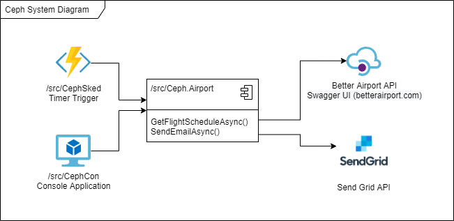

# ceph
This repository contains three projects that utilize [Copenhagen Optimization](https://copenhagenoptimization.com/)'s [Better Airport](https://api.betterairport.com) APIs, to send emails containing a flightschedule as an attached csv file.
  1. [/src/CephSked](src/CephSked) - an Azure Timer Trigger Function that runs on a default schedule of once per day at 15:00 based on the timezone of the Azure Function Configuration.
  2. [/src/CephCon](src/CephCon) - a console application that can be run from the command line.
  3. [/src/Ceph.Airport](src/Ceph.Airport) - a class library that performs all of the business logic.

## System Diagram
The following diagram illustrates how each of these work together

## A little more about Ceph.Airport
The bulk of the business flow (of which there is little), is contained in the **GetFlightScheduleAsync** method. This method retrieves the flight schedule from the BetterAirport API for a specific date, formats it as a CSV file using CSVHelper, and emails it to multiple recipients using Twilio's SendGrid API.

## Getting Up And Running
Open the .sln in visual studio and set your startup project to CephCon. Before building and running, You will need to:
  1. Copy the launchSettings.template.json file to launchSettings.json in the CephCon/Properties folder.
  2. Edit the launchSettings.json file to use appropriate API Keys and Email Names.
 
